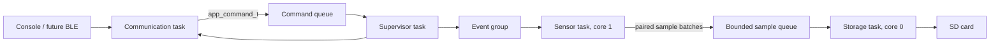

# DigiEquine V3 Firmware

DigiEquine V3 is an ESP-IDF firmware architecture for the ESP32-S3 equine
monitor. It replaces the single-file Arduino sketch with testable components,
explicit resource ownership, and FreeRTOS message passing.

## Build

Install ESP-IDF 5.2 or newer, open an ESP-IDF terminal, then run:

```powershell
idf.py set-target esp32s3
idf.py build
idf.py -p COMx flash monitor
```

Console commands in this baseline build:

```text
START
STOP
HORSE <name>
```

## Component Boundaries

| Component | Responsibility | Owns |
|---|---|---|
| `board_config` | Released PCB configuration | Pins, buses, electrical assumptions |
| `bsp` | Board peripheral primitives | GPIO, ADC, and I2C transport |
| `pca9546a` | I2C mux device driver | PCA9546A protocol |
| `max30101` | PPG device driver | MAX30101 registers and FIFO |
| `bmi270` | IMU device driver | BMI270 protocol |
| `sensor_service` | Coordinated sensor acquisition | Pairing and timestamp policy |
| `storage_service` | SD mount and CSV sessions | SD card and open file |
| `comm_service` | External command/status boundary | Console transport task |
| `app_core` | Product behavior and RTOS orchestration | queues, events, system state |

The communication service is intentionally transport-independent at the
application boundary. BLE GATT and WiFi upload adapters can submit the same
typed `app_command_t` messages without changing acquisition or storage code.

## Runtime Design



The sensor task is the only task allowed to use sensor services. Device drivers
own register-level protocols, and `board_config.h` owns PCB assumptions. The storage task
is the only task allowed to open or write the active CSV. This prevents the
cross-core peripheral races present in V2.

## Periodic Collection Timer

`START` begins the first acquisition window immediately and starts an ESP32-S3
GPTimer. The hardware timer raises an alarm every 20 seconds. Its ISR only calls
`vTaskNotifyGiveFromISR()` to release the high-priority sensor task; all I2C and
sample processing stays outside interrupt context.

Each collection window is currently 20 seconds, so windows run consecutively.
Change `APP_COLLECTION_PERIOD_MS` or `APP_COLLECTION_WINDOW_MS` in
`components/app_core/include/app_config.h` to introduce an idle period.

## Important Hardware Validation

The V2 source did not define explicit SPI data/clock pins or MAX30101 interrupt
pins. V3 currently assumes `MOSI=11`, `MISO=13`, `SCLK=12`, and `CS=44`.
Confirm these against the schematic before flashing.

The V2 LED comments contradicted its active levels. V3 currently treats GPIO
high as LED on because that matches the actual V2 macros. Change
`bsp_led_set()` if the schematic confirms active-low common-anode wiring.

## Production Checklist

- Confirm board pinout and add it to a version-controlled hardware definition.
- Add MAX30101 interrupt GPIOs and replace 1 ms FIFO polling with task
  notifications from an ISR.
- Complete BMI270 configuration using Bosch's official sensor API.
- Add a NimBLE GATT adapter and authenticated command protocol.
- Store secrets in encrypted NVS; never hardcode passwords or endpoints.
- Verify Google Drive uploads using TLS certificate validation and only accept
  HTTP 2xx responses.
- Add brownout, SD removal, FIFO overflow, and power-loss tests.
- Add host unit tests and hardware-in-loop regression tests.

See [docs/ARCHITECTURE.md](docs/ARCHITECTURE.md) for the detailed engineering
walkthrough.

Release gates and remaining hardware-validation work are tracked in
[docs/PRODUCTION_READINESS.md](docs/PRODUCTION_READINESS.md).

Run repository architecture checks with:

```powershell
python tools/check_architecture.py
```

The `app_common/test` component contains Unity tests for data-integrity
primitives. CI performs architecture checks, formatting checks, and a clean
ESP32-S3 build.
